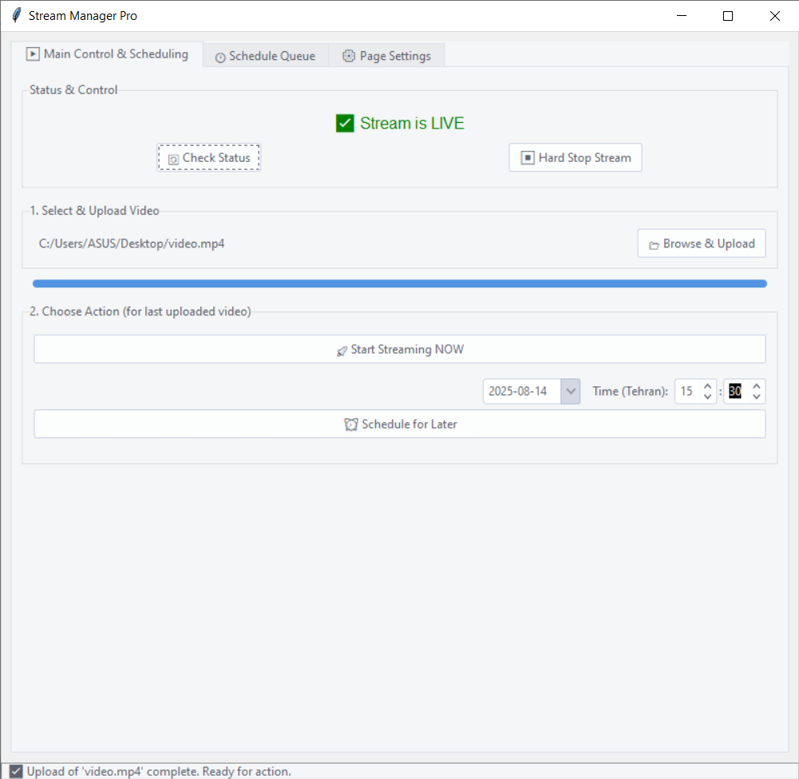

# HLSManager: A Python-Based Video Streaming Suite

[](https://opensource.org/licenses/MIT)

HLSManager is a complete suite for setting up and managing a private video streaming server. It consists of two main components: a powerful Bash script for automated server setup and a user-friendly Python desktop client for stream management.

This project is ideal for educators, small organizations, or developers who need a self-hosted, secure, and easy-to-manage solution for broadcasting pre-recorded videos.



---

## Features

-   **Automated Server Setup:** An interactive Bash script that installs and configures the entire server stack on Ubuntu.
-   **Secure Streaming:** Uses Nginx with RTMP and HLS to deliver video efficiently. SSL is fully supported via Let's Encrypt.
-   **Desktop Management Client:** A cross-platform GUI application (built with Python/Tkinter) to manage your server remotely over SSH.
-   **Stream Scheduling:** Schedule video files to play at a specific date and time.
-   **Live Control:** Check stream status, start streams instantly, and force-stop a running stream.
-   **Remote File Management:** Browse and upload video files directly from the client to the server.
-   **Customizable Player:** Set custom HTML pages for both the live player and the idle/offline state.

## Project Components

1.  **Server Setup Script (`/scripts/setup_stream_server.sh`)**
    * An interactive wizard that automates the installation of Nginx, FFmpeg, and other dependencies. It compiles Nginx with the necessary RTMP and HTTP/2 modules and can automatically configure SSL.

2.  **Desktop Client (`/client/stream_manager.py`)**
    * The graphical user interface for managing the server. It connects via SSH to upload videos, schedule `ffmpeg` jobs using `at`, and manage player templates.

---

## 1. Server Setup Guide

Follow these steps on a fresh **Ubuntu 20.04 or 22.04** server.

### Prerequisites
- A server running Ubuntu 20.04/22.04.
- Root or `sudo` access.
- A domain or subdomain pointed to your server's IP address.

### Installation

The interactive wizard will handle everything for you.

1.  **Clone the repository:**
    ```bash
    git clone https://github.com/mohammadakbarpour/HLSManager.git
    cd HLSManager/scripts/
    ```

2.  **Make the script executable:**
    ```bash
    chmod +x setup_stream_server.sh
    ```

3.  **Run the wizard as root:**
    ```bash
    sudo ./setup_stream_server.sh
    ```

4.  **Follow the on-screen instructions:**
    * Choose **"Start Full Installation"**.
    * The wizard will check for conflicting services (like Apache2), install dependencies, and ask you to provide the Nginx/RTMP source files (either by downloading or using local paths).
    * It will then compile and install Nginx.
    * Finally, it will ask if you want to set up a free SSL certificate. It's highly recommended to say yes. Provide your domain and an email address.
    * The script will complete the final configuration and start the server.

---

## 2. Client Usage Guide

The desktop client allows you to control the server you just set up.

### Prerequisites
- Python 3.x installed on your local computer.
- `pip` for installing packages.

### Installation

1.  **Navigate to the client directory:**
    ```bash
    cd HLSManager/client/
    ```

2.  **(Important)** Create a `requirements.txt` file in this directory with the following content:
    ```txt
    paramiko
    pytz
    tkcalendar
    ttkthemes
    ```

3.  **Install the required Python packages:**
    ```bash
    pip install -r requirements.txt
    ```

### Running the Client

1.  **Execute the Python script:**
    ```bash
    python stream_manager.py
    ```
2.  **Log In:** A login window will appear. Enter your server's IP address, SSH port (usually 22), username (e.g., `root`), and password.
3.  **Manage Streams:**
    * **Main Control Tab:** Upload video files, start them instantly, or schedule them for a later time. You can also check the current stream status and stop it.
    * **Schedule Queue Tab:** View all scheduled streaming jobs and cancel them if needed.
    * **Page Settings Tab:** Upload custom HTML files to be used for your player page and the offline/idle page.

## Tech Stack

-   **Backend/Server:** Bash, Nginx, Nginx-RTMP-Module, FFmpeg, HLS, Let's Encrypt (Certbot)
-   **Client/Desktop App:** Python, Tkinter, ttkthemes, Paramiko

## License

Distributed under the MIT License. See `LICENSE` for more information.
